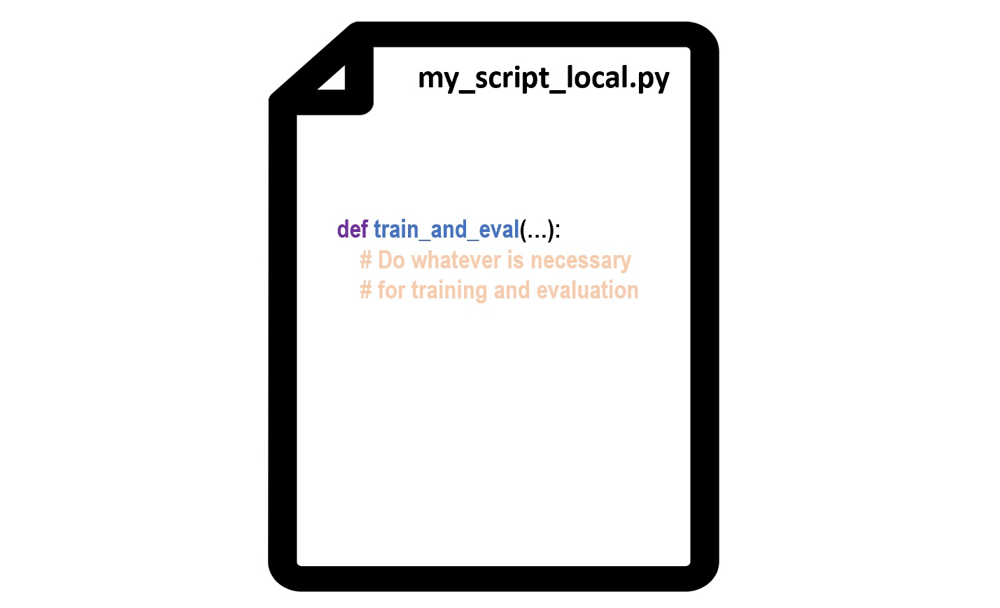
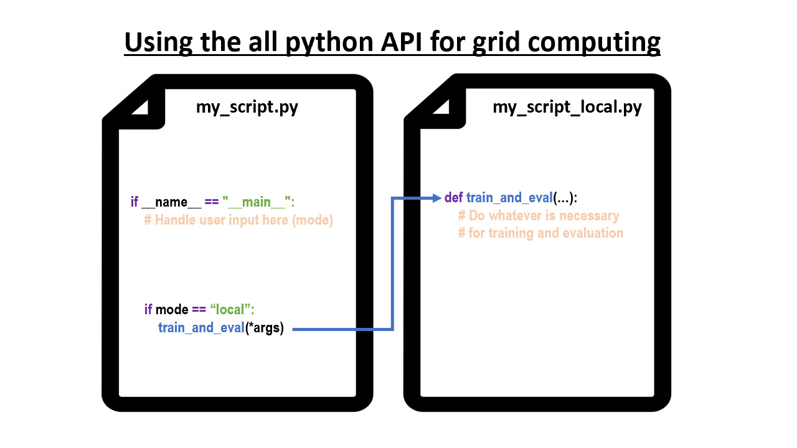
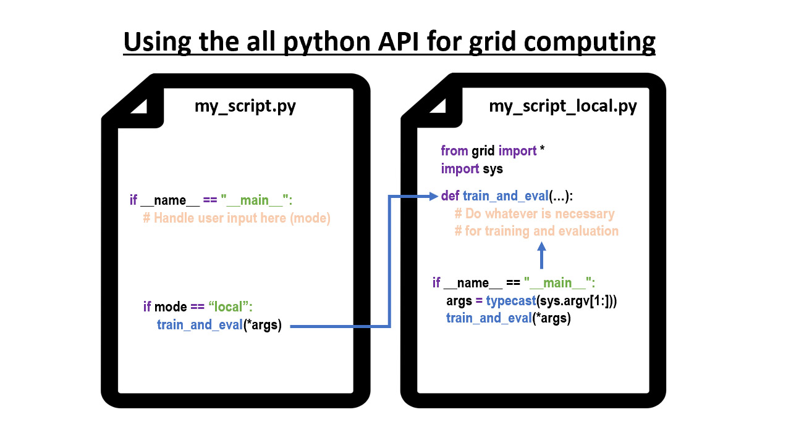
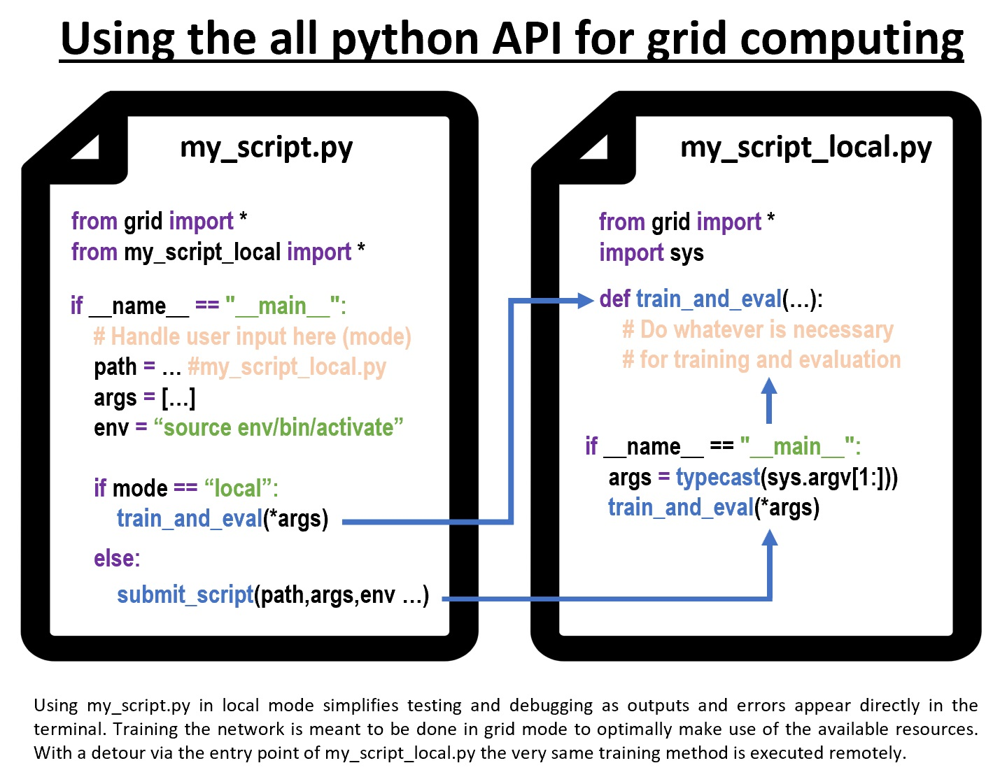

# Using the all python API for grid computing

As we all love grid computing I thought it was nice to share with you how you can achieve it with our all python API in wich we wrapped the call to qsub including it's parameters such that you do not have to think to much about shell scripting.

<video width="100%" alt="test" controls>
        <source src="grid.mp4" type="video/mp4">
</video>


## Submit a gridjob including parameters in a single call
Using the tool is fairly simple. All you need to do is to import everything from our tiny library grid. And then you're ready to go.

You can use the contained method submit script to run your python script in the grid. You only need to specify the path to your script, a list of arguments (here it's empty) and a string that activates your python, pip or conda virtual environment.

The script is scheduled and executed when the resources are available. The output and error files are written to your home directory.


```python
from grid import *
submit_script(“/net/home/student/m/yourusername/test.py”, [],
              ”source /net/home/student/yourfirstletter/yourusername/env/bin/activate”)
```

Important additional arguments for submit scripts are the amount of memory (RAM) you need for computation and the amount of cuda cores.

## Check if your script is running and delete all gridjobs

In case you want to check the status of your script you can use *qstat* in the command line. 


```python
qstat
```

If you want to stop execution of all your gridjob use *qdel -u yourusername*.


```python
qdel -u yourusername
```

## Get your code running in the grid

It might be that you already have some code for training and evaluating a machine learning classifier or a neural network and the main thing you want to achieve is to run that code in the grid. 

Let's say you have a method train and eval that performs the learning part in a script called your_script_local.py and this method even has some parameters.




Format: 


As we've seen in principal a single call to submit script is enough to even send parameters to a script that is executed remotely. Hence its a good idea to **have a second script to start local and remote processing**. Consider making your startup script the interface for a user by making it a command line tool.

## The benefits of having a local mode in your startup script

If you design your startup script such that you can run your code in a mode local you can directly receive feedback in the terminal. Otherwise you will have to wait until it is executed in the grid and open the error and outputfiles. The local mode speeds up this feedback loop.



## Automatic typecasting for command line parameters
Train and eval is thought to have some parameters. To run it in the grid while having access to named parameters you can make my_script_local.py a shell script. By doing so you can access the command line parameters. If you import grid you can use the contained method typecast. It parses the arguments passed to my_script_local.py and e.g. automatically converts string representations of floats or integers (e.g. 4.2 or 42) to the respective numerical value and even works with lists (e.g. when calling python my_script_local.py 4.2 42 [4,2]). 



## Finish your startup script and submit your script
To finally submit the script to the grid set the values for the path of my_script_local.py, the list of arguments and specify the string to activate your desired environment. Then call submit_script() with named arguments. Here we want to do so when running in grid mode. Important additional arguments of submit_script are memory (e.g. "2G") and the number of cuda cores (for GPU computation, default is zero).


As you can see the combination of submit_script() in your starter script my_script.py and typecast() in your worker my_script_local.py allows you to use the very same list of arguments (args) remotely. This simplifies the search for errors: When the script runs in mode local but not in mode grid it is unlikely an issue with your code for trianing and evaluation but rather a problem with the installation in the environment.



## Limitations
Mind that the number of characters to be passed as arguments via *submit_script()* is limited (several thousand characters still work). If you need to pass large amounts of data it's a better idea to pass the path to an initialization file that can be loaded by the gridjob that runs *my_script.py* and contains all the necessary information.
